# Storybook Controls Guide

This component library includes the **@storybook/addon-controls** addon, which allows you to dynamically interact with component props in real-time.

## 🎮 How to Use Controls

When you run Storybook (`npm run storybook`), you'll see a **Controls** panel at the bottom of the interface.

### Available Controls by Component

---

## 📥 Input Component

The Input component has the following interactive controls:

| Control | Type | Description |
|---------|------|-------------|
| **type** | Select | Choose input type: text, password, number, email, tel |
| **label** | Text | Edit the label displayed above the input |
| **placeholder** | Text | Change the placeholder text |
| **clearable** | Boolean | Toggle the clear button on/off |
| **error** | Text | Add or edit error message |
| **success** | Boolean | Toggle success state styling |
| **fullWidth** | Boolean | Make input full width or fixed width |
| **disabled** | Boolean | Enable or disable the input |
| **defaultValue** | Text | Set initial value for the input |

### Try It Out:
1. Open **Components/Input** in Storybook
2. Select any story (e.g., "Default" or "Password")
3. Use the Controls panel to:
   - Change `type` from "text" to "password"
   - Toggle `clearable` to see the clear button
   - Add an `error` message
   - Enable `success` state

---

## 🔔 Toast Component

The Toast component has the following interactive controls:

| Control | Type | Description |
|---------|------|-------------|
| **message** | Text | Edit the notification message |
| **type** | Select | Choose toast type: success, error, warning, info |
| **duration** | Number | Set auto-dismiss time in ms (0 = no auto-dismiss) |
| **closable** | Boolean | Show/hide the close button |
| **show** | Boolean | Toggle toast visibility |

### Try It Out:
1. Open **Components/Toast** in Storybook
2. Select the "Success" story
3. Use the Controls panel to:
   - Change `message` to your custom text
   - Switch `type` to "error" or "warning"
   - Adjust `duration` slider (0-10000ms)
   - Toggle `closable` to remove close button
   - Toggle `show` to hide/show toast

---

##  Sidebar Menu Component

The Sidebar Menu component has the following interactive controls:

| Control | Type | Description |
|---------|------|-------------|
| **title** | Text | Edit the sidebar header title |
| **width** | Number | Adjust sidebar width (200-600px) |
| **isOpen** | Boolean | Control sidebar visibility |

---

## 📚 Interactive Stories

Some stories have **custom render functions** that demonstrate real component behavior:

#### Sidebar Menu Stories
- Each story includes an "Open Menu" button
- Click to toggle sidebar visibility

### Combining Controls

You can combine multiple controls to test complex scenarios:

**Example 1: Input Component**
```
type: password
clearable: true
error: "Password is too weak"
label: "New Password"
```

**Example 2: Toast Component**
```
type: warning
message: "Your session will expire soon!"
duration: 5000
closable: true
```

---

## 💡 Tips for Using Controls

1. **Reset to Defaults**: Click the circular arrow icon next to any control to reset it
2. **Clear All**: Use the "Reset all" button in the Controls panel
3. **Live Updates**: Changes apply immediately - no need to refresh
4. **Combine with Actions**: Check the Actions panel to see event callbacks
5. **Responsive Testing**: Use the Viewport toolbar to test different screen sizes

---

## 📖 Documentation

Each component also has auto-generated documentation showing:
- Available props and their types
- Default values
- Descriptions
- Usage examples

Access it via the **Docs** tab in Storybook.

---

## 🚀 Quick Start Checklist

- [x] Run `npm run storybook`
- [x] Browse to any component story
- [x] Open the **Controls** panel (bottom of screen)
- [x] Start experimenting with props!

---

## 🎨 Component Examples

### Input Component

<table>
  <tr>
    <td align="center" width="50%">
      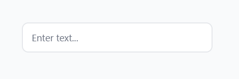
      <br />
      <b>Default State</b>
    </td>
    <td align="center" width="50%">
      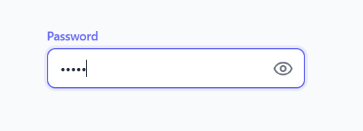
      <br />
      <b>Password with Toggle</b>
    </td>
  </tr>
  <tr>
    <td align="center" width="50%">
      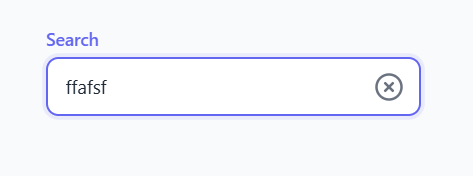
      <br />
      <b>With Clear Button</b>
    </td>
    <td align="center" width="50%">
      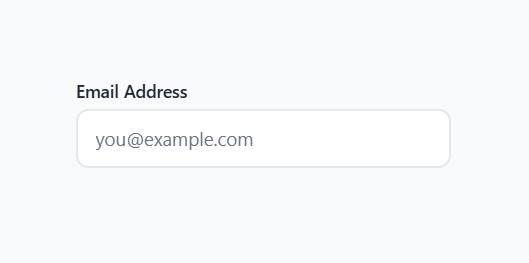
      <br />
      <b>Error State</b>
    </td>
  </tr>
  <tr>
    <td align="center" colspan="2">
      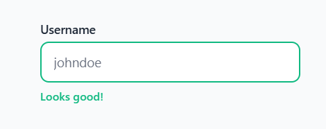
      <br />
      <b>Success State</b>
    </td>
  </tr>
</table>

---

### Toast Component

<table>
  <tr>
    <td align="center" width="50%">
      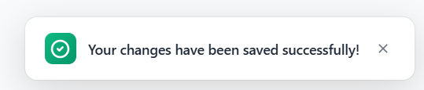
      <br />
      <b>Success Toast</b>
    </td>
    <td align="center" width="50%">
      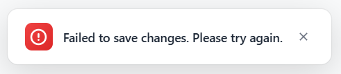
      <br />
      <b>Error Toast</b>
    </td>
  </tr>
  <tr>
    <td align="center" width="50%">
      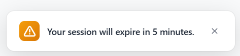
      <br />
      <b>Warning Toast</b>
    </td>
    <td align="center" width="50%">
      
      <br />
      <b>Info Toast</b>
    </td>
  </tr>
  <tr>
    <td align="center" colspan="2">
      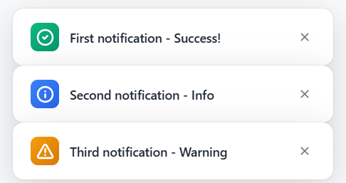
      <br />
      <b>Multiple Toasts</b>
    </td>
  </tr>
</table>

---

### Sidebar Menu

<table>
  <tr>
    <td align="center">
      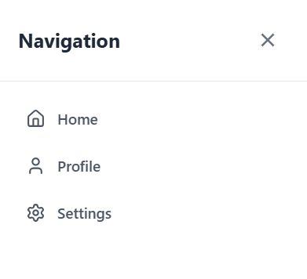
      <br />
      <b>Closed State & Simple Menu</b>
    </td>
  </tr>
  <tr>
    <td align="center">
      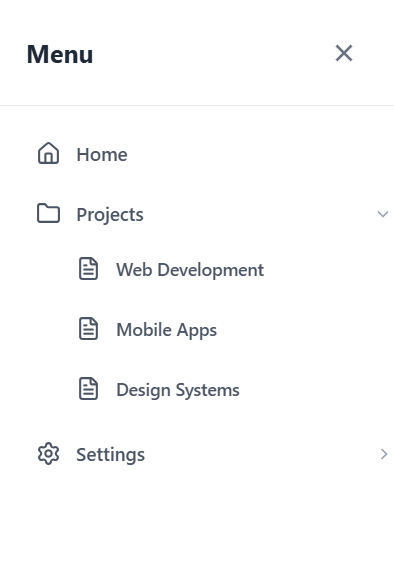
      <br />
      <b>Nested Menu (Collapsed & Expanded)</b>
    </td>
  </tr>
  <tr>
    <td align="center">
      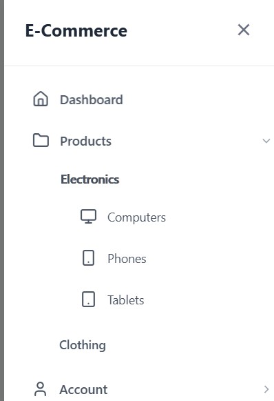
      <br />
      <b>Deeply Nested (2 Levels)</b>
    </td>
  </tr>
</table>

---

Happy experimenting! 🎉